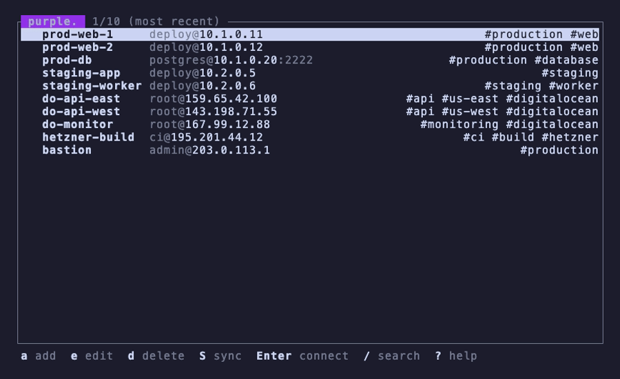

<h1 align="center">🟣 purple.</h1>

<p align="center"><strong>A smart, fast SSH launcher for your terminal.</strong></p>

<p align="center">
  <a href="https://crates.io/crates/purple-ssh"></a>
  <a href="https://crates.io/crates/purple-ssh"></a>
  <a href="LICENSE"></a>
</p>

<p align="center">
  Bookmarks for your SSH hosts. Search, tag, connect.<br>
  Reads your <code>~/.ssh/config</code> and writes it back byte-for-byte.<br>
  Rust. Single binary. No lock-in.
</p>

<br>

<p align="center"></p>

<br>

<p align="center">
  purple is a keyboard-driven TUI that turns your SSH config into a searchable, taggable launcher.<br>
  Browse 50 hosts in a keystroke. Press Enter to connect. Manage the rest without opening an editor.<br>
  Your comments, formatting and unknown directives survive every edit.
</p>

<br>

---

## ✨ Features

&nbsp;&nbsp;&nbsp;&nbsp;**Launch fast.** &nbsp; `purple` opens the TUI. `purple myserver` connects directly. `purple prod` opens pre-filtered.

&nbsp;&nbsp;&nbsp;&nbsp;**Search everything.** &nbsp; Matches alias, hostname and user as you type. Match count updates live.

&nbsp;&nbsp;&nbsp;&nbsp;**Ping before you connect.** &nbsp; TCP reachability check. One host or all of them.

&nbsp;&nbsp;&nbsp;&nbsp;**Tags and groups.** &nbsp; Tag hosts with labels. Filter with `tag:prod`. Comments become visual group headers.

&nbsp;&nbsp;&nbsp;&nbsp;**Sort your way.** &nbsp; Config order, alphabetical, most used or most recent. purple remembers your preference.

&nbsp;&nbsp;&nbsp;&nbsp;**SSH key browser.** &nbsp; Fingerprints, linked hosts, key types. Pick a key from the form with Ctrl+K.

&nbsp;&nbsp;&nbsp;&nbsp;**Quick-add and import.** &nbsp; `purple add user@host:port` from the CLI. Bulk import from a file or known_hosts.

&nbsp;&nbsp;&nbsp;&nbsp;**Include support.** &nbsp; Reads Include directives recursively. Multi-file configs just work.

&nbsp;&nbsp;&nbsp;&nbsp;**Clipboard.** &nbsp; Copy the SSH command or the full config block. macOS, Wayland and X11.

&nbsp;&nbsp;&nbsp;&nbsp;**Auto-reload and undo.** &nbsp; Detects external changes. Undo accidental deletes with `u`.

---

## 🔒 Safe by default

| | |
|---|---|
| **Round-trip fidelity** | Comments, formatting, unknown directives. All preserved. |
| **Atomic writes** | Temp file, chmod 600, rename. No half-written configs. |
| **Automatic backups** | Every write creates a backup. Keeps the last 5. |
| **Works everywhere** | ANSI 16 colors. Any terminal, any theme, any monospace font. |
| **NO_COLOR** | Respects the [NO_COLOR](https://no-color.org/) standard. |
| **Shell completions** | Bash, zsh and fish. |

---

## 📦 Install

**Homebrew (macOS)**
```bash
brew install erickochen/purple/purple
```

**Cargo**
```bash
cargo install purple-ssh
```

**From source**
```bash
git clone https://github.com/erickochen/purple.git && cd purple && cargo build --release
```

---

## 🚀 Usage

```bash
purple                              # Launch the TUI
purple myserver                     # Connect or search
purple -c myserver                  # Direct connect
purple --list                       # List all hosts
purple add deploy@10.0.1.5:22      # Quick-add a host
purple import hosts.txt             # Bulk import from file
purple import --known-hosts         # Import from known_hosts
purple --completions zsh            # Shell completions
```

---

<details>
<summary><strong>Keybindings</strong> &mdash; press <code>?</code> in the TUI for the cheat sheet</summary>

<br>

**Host List**

| Key | Action |
|-----|--------|
| `j` / `k` | Navigate up and down |
| `Enter` | Connect to selected host |
| `a` | Add new host |
| `e` | Edit selected host |
| `d` | Delete selected host |
| `c` | Clone host |
| `y` | Copy SSH command |
| `x` | Export config block to clipboard |
| `/` | Search and filter |
| `t` | Tag host |
| `s` | Cycle sort mode |
| `i` | Inspect host details |
| `u` | Undo last delete |
| `p` | Ping selected host |
| `P` | Ping all hosts |
| `K` | SSH key list |
| `?` | Help |
| `q` / `Esc` | Quit |

**Search**

| Key | Action |
|-----|--------|
| Type | Filter hosts |
| `Enter` | Connect to selected |
| `Esc` | Cancel search |
| `Tab` / `Shift+Tab` | Next / previous result |

**Form**

| Key | Action |
|-----|--------|
| `Tab` / `Shift+Tab` | Next / previous field |
| `Ctrl+K` | Pick SSH key |
| `Enter` | Save |
| `Esc` | Cancel |

</details>

<br>

<p align="center">
  💜 <a href="LICENSE">MIT License</a>
</p>
