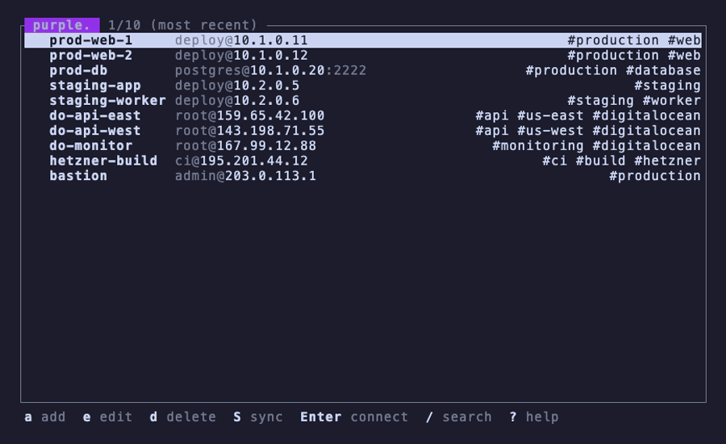

<h1 align="center">🟣 purple.<br>Manage SSH configs.<br>Launch connections.<br>All from the terminal.</h1>

<p align="center">
  <strong>Stop grepping your SSH config. Start launching from it.</strong><br>
  Search, tag and connect your hosts. Sync servers from DigitalOcean, Vultr, Linode, Hetzner and UpCloud. Your config stays respected.
</p>

<p align="center">
  <a href="https://crates.io/crates/purple-ssh"></a>
  <a href="https://crates.io/crates/purple-ssh"></a>
  <a href="LICENSE"></a>
</p>

<p align="center">
  purple is a free, open-source SSH config manager and host launcher written in Rust. It reads your existing <code>~/.ssh/config</code>,
  lets you search, filter, tag and connect with a single keystroke, and writes changes back without
  touching your comments or unknown directives. Sync servers from five cloud providers
  directly into your config. No browser, no YAML files, no context switching.
</p>

<p align="center"></p>

## Install

```bash
curl -fsSL getpurple.sh | sh
```

<details>
<summary>Other install methods</summary>

<br>

**Homebrew (macOS)**

```bash
brew install erickochen/purple/purple
```

**Cargo** (crate name: `purple-ssh`)

```bash
cargo install purple-ssh
```

**From source**

```bash
git clone https://github.com/erickochen/purple.git
cd purple && cargo build --release
```

</details>

## Update

```bash
purple update
```

Downloads the latest release from GitHub, verifies the checksum and replaces the binary in place. macOS only (installed via `curl`). Homebrew users should run `brew upgrade erickochen/purple/purple` instead. Cargo users should run `cargo install purple-ssh`. The TUI also checks for updates on startup and shows a notification in the title bar when a new version is available.

## Launch, search and connect

🚀 **Instant search.** Filter on alias, hostname, user, tags or provider as you type

🏷️ **Tags.** Label hosts with #tags, filter with the tag picker or `tag:` search

📊 **Connection history.** Frecency sorting surfaces your most-used and most-recent hosts

📡 **Ping.** TCP connectivity check per host or all at once

📥 **Bulk import.** From a hosts file or `~/.ssh/known_hosts`

🔑 **SSH key management.** Browse keys with metadata and linked hosts

🔀 **Tunnels.** Add, edit and manage LocalForward, RemoteForward and DynamicForward per host. Start and stop background tunnels from the TUI.

📋 **Clipboard.** Copy the SSH command or full config block

## Cloud provider sync

Pull your servers from DigitalOcean, Vultr, Linode, Hetzner and UpCloud directly into `~/.ssh/config`. Sync adds new hosts, updates changed IPs and merges tags. Tags you add manually are preserved across syncs. Use `--reset-tags` to replace local tags with provider tags. Preview with `--dry-run`.

```bash
purple provider add digitalocean --token YOUR_TOKEN   # or use PURPLE_TOKEN env var
purple sync
```

Synced hosts are tagged by provider and appear alongside your manual hosts.

## Your config, respected

🔄 **Round-trip fidelity.** Comments, indentation and unknown directives are preserved through every read-write cycle. Consecutive blank lines are collapsed to keep your config clean.

📂 **Include support.** Hosts from Include files are displayed but never modified

🔒 **Atomic writes.** Temp file, chmod 600, rename. No half-written configs.

💾 **Automatic backups.** Every write to an existing config creates a timestamped backup. Keeps the last 5.

♻️ **Auto-reload.** Detects external config changes and reloads automatically

🎨 **Monochrome UI.** Works in any terminal, any font. One splash of color (the purple badge). Respects [NO_COLOR](https://no-color.org/).

🐚 **Shell completions.** Bash, zsh and fish.

## Get started

```bash
purple
```

That's it. purple reads your `~/.ssh/config` and shows your hosts. Navigate with `j`/`k`, search with `/`, connect with `Enter`. Press `?` for the full cheat sheet.

## Usage

```bash
purple                              # Launch the TUI
purple myserver                     # Connect or search
purple -c myserver                  # Direct connect
purple --list                       # List all hosts
purple add deploy@10.0.1.5:22      # Quick-add a host
purple import hosts.txt             # Bulk import from file
purple import --known-hosts         # Import from known_hosts
purple provider add digitalocean    # Configure cloud provider
purple sync                         # Sync all providers
purple sync --dry-run               # Preview sync changes
purple sync --reset-tags            # Replace local tags with provider tags
purple tunnel list                  # List configured tunnels
purple tunnel add myserver L:8080:localhost:80  # Add forward
purple tunnel start myserver        # Start tunnel (Ctrl+C to stop)
purple update                       # Update to latest version
purple --completions zsh            # Shell completions
```

<details>
<summary><strong>Keybindings</strong> — press <code>?</code> in the TUI for the cheat sheet</summary>

<br>

**Host List**

| Key         | Action                           |
| ----------- | -------------------------------- |
| `j` / `k`   | Navigate up and down             |
| `Enter`     | Connect to selected host         |
| `a`         | Add new host                     |
| `e`         | Edit selected host               |
| `d`         | Delete selected host             |
| `c`         | Clone host                       |
| `y`         | Copy SSH command                 |
| `x`         | Export config block to clipboard |
| `/`         | Search and filter                |
| `#`         | Filter by tag                    |
| `t`         | Tag host                         |
| `s`         | Cycle sort mode                  |
| `g`         | Group by provider                |
| `i`         | Inspect host details             |
| `u`         | Undo last delete                 |
| `p`         | Ping selected host               |
| `P`         | Ping all hosts                   |
| `S`         | Cloud provider sync              |
| `T`         | Manage host tunnels              |
| `K`         | SSH key list                     |
| `?`         | Help                             |
| `q` / `Esc` | Quit                             |

**Tunnel List**

| Key         | Action                 |
| ----------- | ---------------------- |
| `j` / `k`   | Navigate up and down   |
| `Enter`     | Start / stop tunnel    |
| `a`         | Add tunnel             |
| `e`         | Edit tunnel            |
| `d`         | Delete tunnel          |
| `q` / `Esc` | Back                   |

**Provider List**

| Key         | Action                 |
| ----------- | ---------------------- |
| `j` / `k`   | Navigate up and down   |
| `Enter`     | Configure provider     |
| `s`         | Sync selected provider |
| `d`         | Remove provider        |
| `q` / `Esc` | Back (cancels syncs)   |

**Search**

| Key                 | Action                 |
| ------------------- | ---------------------- |
| Type                | Filter hosts           |
| `Enter`             | Connect to selected    |
| `Esc`               | Cancel search          |
| `Tab` / `Shift+Tab` | Next / previous result |

**Form**

| Key                 | Action                |
| ------------------- | --------------------- |
| `Tab` / `Shift+Tab` | Next / previous field |
| `Ctrl+K`            | Pick SSH key          |
| `Enter`             | Save                  |
| `Esc`               | Cancel                |

</details>

## What makes purple different?

**It edits your real SSH config.** Most SSH config tools only read. purple reads, edits and writes `~/.ssh/config` directly.

**It doesn't break anything.** Comments, indentation, unknown directives. All preserved through every edit. Tested with 736 tests including round-trip integration.

**It syncs your cloud servers.** purple is the only SSH config manager we know of that pulls hosts from DigitalOcean, Vultr, Linode, Hetzner and UpCloud directly into your config. Configure once, sync anytime.

**It imports what you already have.** Bulk import from host files or `~/.ssh/known_hosts`. No manual re-entry.

**It's a single Rust binary.** No runtime, no daemon, no async framework. Install and run.

## FAQ

**Does purple modify my existing SSH config?**
Only when you add, edit, delete or sync. Auto-sync runs on startup if you have providers configured. All writes are atomic with automatic backups.

**Will purple break my comments or formatting?**
No. purple preserves comments, indentation and unknown directives through every read-write cycle. Consecutive blank lines are collapsed to one.

**Does purple need a daemon or background process?**
No. It's a single binary. Run it, use it, close it.

**Does purple send my SSH config anywhere?**
No. Your config never leaves your machine. Provider sync calls cloud APIs to fetch server lists. The TUI checks GitHub for new releases on startup (cached for 24 hours). No config data is transmitted in either case.

**Why is the crate called `purple-ssh`?**
The name `purple` was taken on crates.io. The binary is still called `purple`.

## Built with

Rust. 736 tests. Zero clippy warnings. No async runtime. Single binary.

<p align="center">
  💜 <a href="LICENSE">MIT License</a>
</p>
